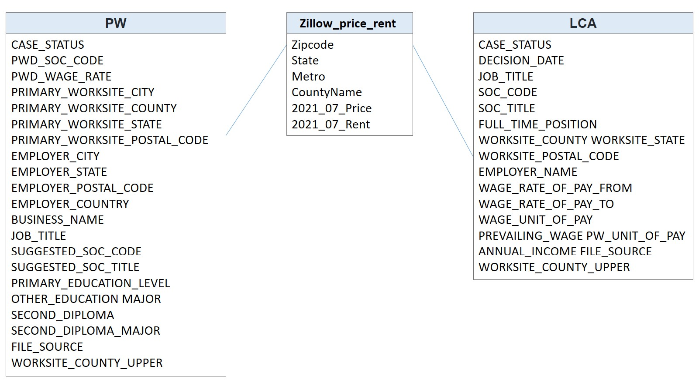

# Analyze-H1B-PW-data

## Objectives
Most of my income spend on rent. I would like to know if the same happen to all Americans and immigrants. Therefore, I load the income, rent, and price data to Spark. I believe we can come up with some ideas to be rich by looking into this data. 

## Data Source
**PW** - Data from Department of Labor. Definition: The prevailing wage is used as a measure of the minimum allowable wage to be paid by employers seeking to employ a foreign national in H-1B status. It is a calculation of the average wage rate paid by employers to similarly-employed workers in substantially comparable jobs in the geographic area of intended employment. Size: 4 files, 600k rows.  

**LCA** - Data from Department of Labor, disclose H1B applicants' income and demographic information. Size: 2 files, 460k rows.  

**Home Rent and Price** - Data from Zillow. Size: 2 files, 60k rows.  

## Data Quality Checks and ETL pipeline:

### step 1: Get the wage data
download the data from Department of Labor  
exploratory data analysis  

### step 2: Get the housing data
download the data from Zillow  
exploratory data analysis  

### step 3: Build an ETL pipeline for the wage data
Extract data from S3 -> process them using Spark -> load the data back into S3  

Data Quality Checks for LCA:  
* CASE_STATUS must be certified
* must have DECISION_DATE
* must have JOB_TITLE, SOC_CODE, SOC_TITLE, FULL_TIME_POSITION
* FULL_TIME_POSITION must be true
* must have WORKSITE_COUNTY, WORKSITE_STATE, WORKSITE_POSTAL_CODE, EMPLOYER_NAME

Data Quality Checks for PW:  
* must have PWD_SOC_CODE, PWD_WAGE_RATE
* must have PRIMARY_WORKSITE_CITY, PRIMARY_WORKSITE_STATE, PRIMARY_WORKSITE_POSTAL_CODE
* CASE_STATUS must be Determination Issued, cannot be Withdrawn
* must have EMPLOYER_LEGAL_BUSINESS_NAME
* must have EMPLOYER_CITY, EMPLOYER_STATE, EMPLOYER_POSTAL_CODE
* EMPLOYER_COUNTRY must be UNITED STATES OF AMERICA
* must have JOB_TITLE, SUGGESTED_SOC_CODE, SUGGESTED_SOC_TITLE

### step 4: Build an ETL pipeline for the housing data
Extract data from S3 -> process them using Spark -> load the data back into S3  

### step 5: Post-processing Data Quality Checks
After Step 1 to 4, check the tables to see
* If number of rows > 0
* If number of columns > 0
* If data schema is what we expect to see

## Data Scehma
I choose star schema. It's a greate choice as I'm going to join the tables and perform analysis. It's easy to understand and build.

**Fact table - Zillow_price_rent** - Data from Zillow, average home rent and price by zipcode  
| Column Name   | Data Type | Description                                                |
|---------------|-----------|------------------------------------------------------------|
| Zipcode       | long      | Zip Code in United States                                  |
| State         | string    | State (Abbreviation)                                       |
| Metro         | string    | Metropolitan area                                          |
| CountyName    | string    | County                                                     |
| 2021_07_Price | double    | Zillow home value index in 2020/07 (Adjusted, Smoothed)    |
| 2021_07_Rent  | double    | Zillow observed rent index in 2020/07 (Adjusted, Smoothed) |

**Dimensional table - PW** - Prevailing Wage  
| Column Name                  | Data Type | Description |
|------------------------------|-----------|-------------|
| id                           | long      |(New) Unique Identifier |
| CASE_STATUS                  | string    |Status associated with the last significant event or decision. Valid values include “Determination Issued”, “Redetermination Affirmed”, “Redetermination Modified”, “Center Director Review Affirmed Determination”, “Center Director Review Modified Determination”, and “Withdrawn”. After processing, the status must be Determination |
| PWD_SOC_CODE                 | string    |Standard Occupational Classification (SOC)/Occupational Network (O*NET) code for the occupation issued by OFLC, as classified by the Standard Occupational Classification (SOC) System. |
| PWD_WAGE_RATE                | integer   |Prevailing wage rate issued by OFLC. |
| PRIMARY_WORKSITE_CITY        | string    |Primary worksite |
| PRIMARY_WORKSITE_COUNTY      | string    |Primary worksite |
| WORKSITE_COUNTY_UPPER        | string    |Primary worksite |
| PRIMARY_WORKSITE_STATE       | string    |Primary worksite |
| PRIMARY_WORKSITE_POSTAL_CODE | string    |Primary worksite |
| EMPLOYER_CITY                | string    |Contact information of the employer requesting the prevailing wage determination. |
| EMPLOYER_STATE               | string    |Contact information of the employer requesting the prevailing wage determination. |
| EMPLOYER_POSTAL_CODE         | integer   |Contact information of the employer requesting the prevailing wage determination. |
| EMPLOYER_COUNTRY             | string    |Contact information of the employer requesting the prevailing wage determination. |
| BUSINESS_NAME                | string    |Legal business name of the employer |
| JOB_TITLE                    | string    |Title of the employer’s job |
| SUGGESTED_SOC_CODE           | string    |Employer-suggested code for the job described in the prevailing wage determination |
| SUGGESTED_SOC_TITLE          | string    |Employer-suggested title for the job described in the prevailing wage determination |
| PRIMARY_EDUCATION_LEVEL      | string    |The minimum U.S. diploma or degree required by the employer for the job opportunity |
| OTHER_EDUCATION              | string    |If “Other”, the specific U.S. diploma or degree required |
| MAJOR                        | string    |Major(s) and/or field(s) of study required by the employer for the job opportunity. |
| SECOND_DIPLOMA               | string    |Indicates if the employer requires a second U.S diploma or degree for the job.|
| SECOND_DIPLOMA_MAJOR         | string    |The second U.S. diploma or degree and major(s) and/or fields(s) of study required by the employer for the job opportunity, if applicable. |
| FILE_SOURCE           | string    |(New) From which file download from Department of Labor. |

Reference: https://www.dol.gov/sites/dolgov/files/ETA/oflc/pdfs/PW_Record_Layout_FY2021_Q3_old_form.pdf

**Dimensional table - LCA** - H1B applicant's data  
| Column Name           | Data Type | Description       |
|-----------------------|-----------|-------------------|
| id                    | long      |(New) Unique Identifier |
| JOB_TITLE             | string    |Title of the job. Form ETA-9035 Section B, Item 1|
| SOC_CODE              | string    |Occupational code associated with the job being requested for temporary labor condition, as classified by the Standard Occupational Classification (SOC) System. Form ETA-9035 Section B, Item 2.|
| SOC_TITLE             | string    |Occupational title associated with the SOC/O*NET Code. Form ETA9035 Section B, Item 3 |
| FULL_TIME_POSITION    | string    |Y = Full Time Position; N = Part Time Position|
| WORKSITE_COUNTY       | string    |Worksite Location|
| WORKSITE_COUNTY_UPPER | string    |Worksite Location|
| WORKSITE_STATE        | string    |Worksite Location|
| WORKSITE_POSTAL_CODE  | integer   |Worksite Location|
| EMPLOYER_NAME         | string    |Legal business name of the employer submitting the Labor Condition Application.|
| WAGE_RATE_OF_PAY_FROM | integer   |Wage paid to nonimmigrant workers at the First Worksite Location - lower bound. |
| WAGE_RATE_OF_PAY_TO   | integer   |Wage paid to nonimmigrant workers at the First Worksite Location - upper bound. |
| WAGE_UNIT_OF_PAY      | string    |Unit of pay values include “Hour”, “Week”, “Bi-Weekly”, “Month”, and “Year”.|
| PREVAILING_WAGE       | integer   |Prevailing Wage for the job being requested for First Worksite Location|.
| PW_UNIT_OF_PAY        | string    |Unit of Prevailing Wage Pay for First Worksite Location. |
| ANNUAL_INCOME         | integer   |(New) Annual income derived from WAGE_RATE_OF_PAY_FROM. |
| FILE_SOURCE           | string    |(New) From which file download from Department of Labor. |

Reference: https://www.dol.gov/sites/dolgov/files/ETA/oflc/pdfs/LCA_Record_Layout_FY20.pdf

## This report shows

### Insight 1 - which company pays the best (by prevailing wage and by H1B)

### Insight 2 - which company files the most number of h1b cases

### Insight 3 - which occupation has a high prevailing wage

### Insight 4 - which zipcode area has the highest and lowest Rent-to-Price ratio

### Insight 5 - which zipcode area has the lowest Rent-to-Wage ratio (Aim to indentify the best places to live for new immigrants)

### Insight 6 - which zipcode area has the lowest Price-to-Wage ratio (Aim to indentify the best places to live for new immigrants)

## What if
The data was increased by 100x.  
 --> We can utilize Spark, use more cores, and process the data in parallel.  
The pipelines would be run on a daily basis by 7 am every day.  
 --> We can utilize Airflow or AWS Glue and set up daily pipeline.  
The database needed to be accessed by 100+ people.  
 --> CAP stands for Consistency, Availability and Partition Tolerance. In general, its impossible for a distributed system to guarantee above three at a given point. Based on the CAP theory, we can choose a database that that allows for greater accessibility, such as Cassandra.  

## Why Spark
Spark is suitable for large dataset and supports parallel operations. Also, it supports sql queries. As I am going to further analyze the data, this is quite helpful.

## Appendix:
This project was inspired by
https://pttcareer.com/oversea_job/M.1601580566.A.B11.html
